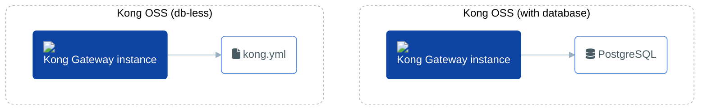

# Kong OSS in Docker Compose

This Docker Compose file can be used to easily stand up Kong OSS in either db-less or database mode. 


## How to run the Gateway

#### Start gateway in DB-Less mode

1. Navigate to the OSS compose directory

    ```
    cd kong-oss-compose
    ```

2. Set declaritive config in ***config/kong.yaml***. (An example service and route has already been populated)

    ```
    _format_version: "3.0"
    services:
    - connect_timeout: 60000
    enabled: true
    host: mock.insomnia.rest
    name: mockbin_service
    path: /request
    port: 443
    protocol: https
    read_timeout: 60000
    retries: 5
    routes:
    - https_redirect_status_code: 426
        name: mockbin_route
        path_handling: v0
        paths:
        - /mock
        preserve_host: false
        protocols:
        - http
        - https
        regex_priority: 0
        request_buffering: true
        response_buffering: true
        strip_path: true
    write_timeout: 60000

    ```

3. Start the gateway using docker compose

    ```shell
    $ docker compose up -d
    ```

    Alternatively run the **oss-up*** script

    ```
    ./oss-up.sh db-less
    ```

#### Start gateway with a database

1. Create a password file with the Postgres database

    ```
    echo "<your-password-here>" > POSTGRES_PASSWORD
    ```

1. Navigate to the OSS compose directory

    ```
    cd kong-oss-compose
    ```
2. Start the gateway using docker compose

    ```shell
    KONG_DATABASE=postgres docker compose --profile database up -d
    ```

    Alternatively run the **oss-up*** script

    ```shell
    ./oss-up.sh database
    ```

3. Deploy sample config to database

    ```shell
    deck gateway sync config/kong.yaml
    ```

## How to stop the Gateway

#### Stop the db-less gateway
```shell
docker compose down
```

Alternatively run the **oss-up*** script

```shell
./oss-down.sh db-less
```
#### Stop the database-enabled gateway
```shell
docker compose --profile database down 
```

Alternatively run the **oss-up*** script

```shell
./oss-down.sh database
```